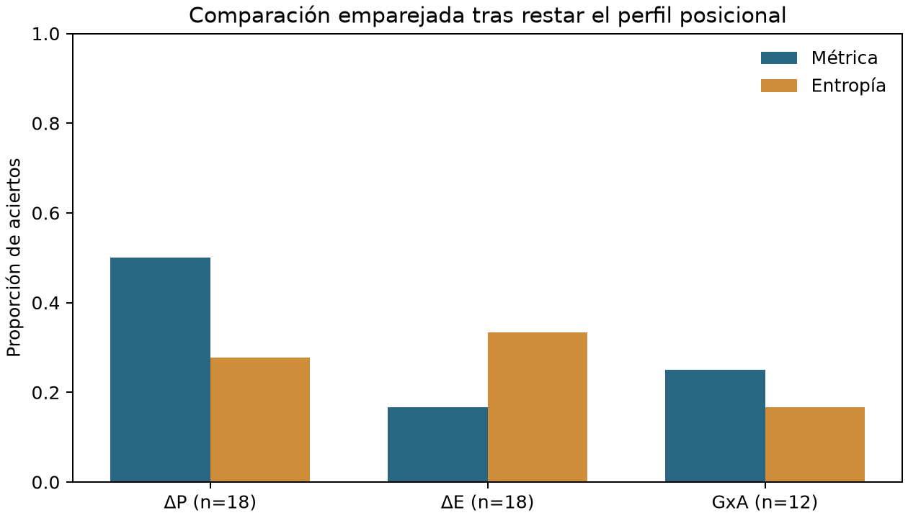
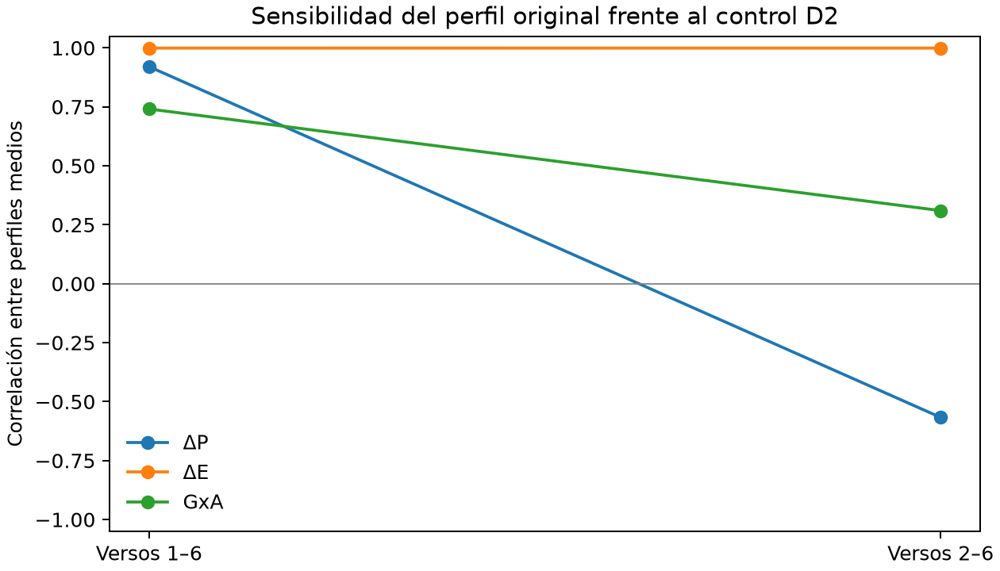
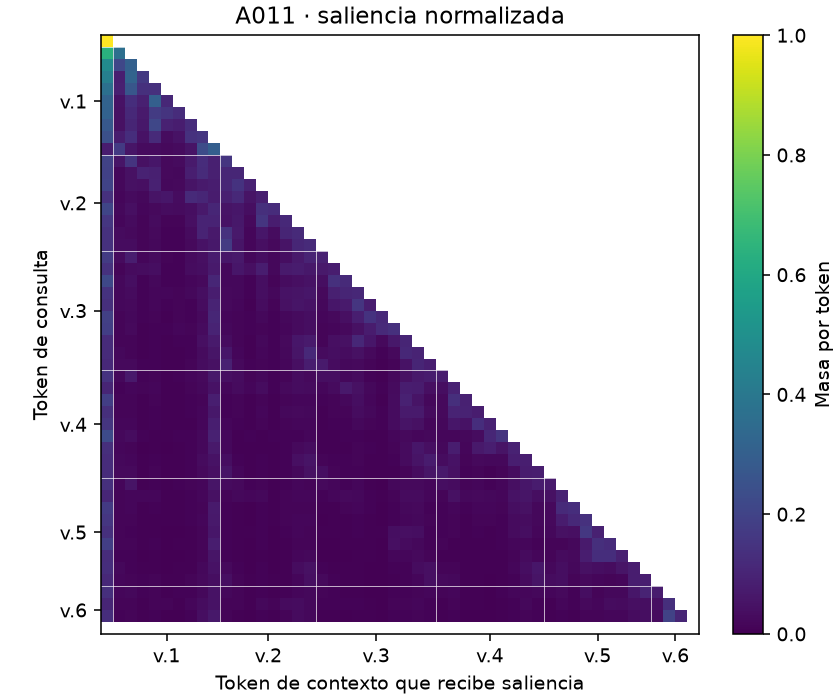

# Evaluación empírica de métricas de AFT8-15 en Mistral

## Implementación y estudio piloto en colaboración con el proyecto AImotional Field Theory AFT8-15

Trabajo Fin de Máster · Máster en Big Data, Data Science e Inteligencia Artificial

Universidad Complutense de Madrid

Autor: Francisco Jose Martinez Fernandez

## Resumen ejecutivo

Este trabajo desarrolla una implementación experimental para AImotional Field Theory AFT8-15, un proyecto que busca llevar un planteamiento teórico hipotético a una fase de evaluación empírica. La colaboración se concreta en código, ejecución y análisis de un piloto de AFT8-15 sobre Mistral-7B-v0.3. Se estudian tres señales internas del modelo: cambio de distribución predictiva (ΔP), variación de entropía (ΔE) y redistribución de saliencia basada en atención por gradiente (GxA). El objetivo es conocer qué información ofrecen estas medidas y qué condiciones hacen falta para interpretar sus resultados.

El sistema procesa 30 textos de seis versos y 60 controles obtenidos al reordenarlos. Conserva las distribuciones derivadas, los estados internos necesarios y las matrices de saliencia, separando la extracción en GPU del análisis local. Las hipótesis se incorporan en la evaluación, no en las entradas del extractor. Esta organización permite revisar cálculos y anotaciones sin volver a ejecutar el modelo cuando los artefactos guardados son suficientes.

La evaluación de máximos produce 6 aciertos en 48 comparaciones con medidas crudas y 15 en 48 después de restar el perfil medio por posición. Esas 48 filas proceden de 30 textos y no constituyen 48 observaciones independientes. Los ocho contrastes nominales por familia y métrica no alcanzan significación al 5 % tras el ajuste de multiplicidad indicado. Las comparaciones emparejadas con entropía tampoco muestran una ventaja estadísticamente respaldada. Estos resultados son exploratorios: el corpus es pequeño y diseñado, los objetivos se concentran al final de los textos y varias transformaciones se ajustan sobre el propio conjunto evaluado.

La extracción limpia reproduce exactamente los 3.240 arrays numéricos comunes de los 90 textos respecto al paquete de referencia, y el análisis reproduce sus 23 tablas CSV. Esta comprobación respalda la consistencia de la implementación en las condiciones registradas; no demuestra que las métricas midan el constructo teórico propuesto. La aportación a AFT8-15 es una base verificable para evaluar ese paso entre teoría y observación, identificar decisiones pendientes y diseñar un experimento posterior más informativo.

## 1. Contexto, necesidad y aportación individual

### 1.1 La colaboración con AFT8-15

AImotional Field Theory AFT8-15 es el proyecto colaborador cuyo planteamiento teórico se somete a instrumentación en este estudio. El trabajo se centra en tres de sus dimensiones operativas y en un único modelo. No pretende completar la teoría ni validar por extensión las dimensiones que no se han medido.

La necesidad práctica es convertir hipótesis formuladas sobre textos en observaciones calculables y revisables. Para el equipo del proyecto, un gráfico de atención o una tasa de acierto solo es útil si se conoce qué se calculó, sobre qué unidades, con qué definición de objetivo y frente a qué referencia. Una implementación reproducible reduce el coste de esa comprobación y evita que las decisiones dependan únicamente de ejemplos visuales seleccionados.

La aportación del autor es la colaboración en el código y en la implementación del paso a la fase empírica: preparación de entradas, instrumentación de Mistral, ejecución del piloto y organización de resultados para su evaluación. La teoría y el marco de colaboración no se presentan como creación individual exclusiva. La memoria delimita la responsabilidad sobre la solución técnica expuesta y su interpretación, dentro de un TFM individual. El autor confirma que dispone de autorización para publicar el material del proyecto empleado en el trabajo.

### 1.2 Valor de la solución

El entregable es un instrumento de investigación funcional: convierte un corpus autorizado en métricas por token y por verso, conserva evidencia y genera análisis con supuestos explícitos. Para AFT8-15 permite decidir qué definiciones deben aclararse antes de ampliar el experimento. El valor del piloto no depende de obtener significación estadística: también reside en detectar que una comparación utiliza unidades dependientes, que un objetivo textual es ambiguo o que una agregación oculta información relevante.

La aplicación a otros corpus es una posibilidad de desarrollo, no una capacidad ya acreditada en este estudio. Tampoco se presenta un servicio de auditoría comercial, una evaluación regulatoria o un sistema de clasificación emocional desplegado. El producto demostrado es el recorrido completo de datos a resultados sobre el piloto definido.

## 2. Objetivos y alcance

### 2.1 Preguntas del estudio

El objetivo general es implementar y evaluar de forma reproducible tres métricas propuestas para la exploración empírica de AFT8-15. Se concreta en cuatro objetivos: conservar la correspondencia entre texto, tokens y versos; calcular señales predictivas y de saliencia bajo una configuración fija; contrastar sus resúmenes con objetivos y referencias comparables; y documentar límites y decisiones que condicionan su interpretación.

La pregunta operativa principal es si el máximo de una medida agregada coincide con el verso objetivo de los textos que la incluyen entre sus hipótesis. Es una reducción deliberada del problema. Una hipótesis que anticipa una caída de incertidumbre no queda evaluada de manera completa buscando un máximo de ΔE. Del mismo modo, una transferencia entre dos palabras requiere observar ambas masas de saliencia; no basta con un pico de redistribución en un verso.

Por ello se distinguen tres niveles de evaluación. El primero verifica la ejecución y la integridad de los resultados. El segundo describe comportamiento numérico, posición y sensibilidad a transformaciones. El tercero explora la relación con las hipótesis del corpus. Superar el primer nivel no garantiza superar los siguientes. Las anotaciones derivadas y los contrastes del reanálisis se identifican como exploratorios, sin presentarlos como un nuevo experimento confirmatorio ni como decisiones registradas antes de observar los resultados.

El alcance comprende Mistral-7B-v0.3 base, 30 originales y sus 60 controles. No incluye una comparación con Llama, entrenamiento, ajuste fino, respuestas a usuarios ni una muestra representativa de todo el lenguaje. El reducido número de textos limita la generalización, aunque la instrumentación de un modelo de esta escala y la conservación de sus matrices planteen un trabajo técnico más amplio que el tamaño del corpus por sí solo sugiere.

### 2.2 Criterios de cumplimiento

El cumplimiento técnico se comprueba mediante evidencias observables. Un texto debe poder reconstruirse desde sus tokens, cada valor agregado debe corresponder a una regla identificable y una ejecución debe dejar los archivos necesarios para rehacer el análisis. El criterio empírico es distinto: las comparaciones deben indicar su denominador, su referencia y las limitaciones que afectan a la conclusión. Un sistema puede cumplir los requisitos técnicos y producir resultados que todavía no respalden las hipótesis.

Esta distinción evita convertir el éxito del proyecto en la obligación de obtener un resultado positivo. Para la colaboración, disponer de un procedimiento que permite examinar una hipótesis y reconocer dónde queda indeterminada es un resultado útil. El piloto se considera una etapa de aprendizaje experimental: aporta mediciones, localiza ambigüedades y reduce el trabajo necesario para formular la siguiente evaluación.

## 3. Solución técnica y flujo de datos

### 3.1 Arquitectura implementada

La solución utiliza Python y organiza las responsabilidades en el paquete `aft8`. El libro fuente se convierte en registros verificables; los controles se generan a partir de permutaciones conservadas; y el extractor recibe únicamente identificador, texto y hash textual. Los objetivos y anotaciones permanecen fuera de esta entrada. Así se evita que una modificación de las etiquetas de evaluación cambie inadvertidamente los datos usados para medir.

| Componente | Función y salida |
|---|---|
| Corpus y controles | Validación del Excel, JSONL y permutaciones D1/D2 |
| Modelo y alineación | Revisión fija, tokenización exacta y asignación a versos |
| Métricas y extracción | Predictivas, gradientes, saliencia y estados internos |
| Persistencia | Tablas Parquet, matrices NPZ y manifiestos con hashes |
| Análisis y diagnósticos | Comparaciones, sensibilidad, spans y figuras |

La extracción utiliza GPU. El análisis consume los artefactos guardados y puede repetirse localmente. Esta separación facilita examinar otra agregación o una anotación alternativa sin alterar los resultados crudos. También impone un límite: guardar un top-k no permite reconstruir posteriormente todo el vocabulario ni recalcular cualquier transformación. Los diagnósticos de temperatura incluidos en este trabajo se calculan durante la extracción y se conservan expresamente.

### 3.2 Controles de ejecución

La configuración utiliza atención eager, pesos bfloat16 y operaciones predictivas en float32. Algunas salidas se almacenan en float64; esta conversión no aumenta la precisión con la que fueron calculadas. Se fija la revisión del modelo y del tokenizador, se añade un único BOS y no se truncan los textos. El sistema comprueba reconstrucción textual exacta, atención causal, valores finitos y normalización, además de la disponibilidad de gradientes.

El smoke A001/A013 precede a los conjuntos completos. Estos requieren un manifiesto de smoke terminado y artefactos compatibles con el mismo código y revisión. Cada texto completado deja un checkpoint. Si se produce un fallo, se conserva el estado alcanzado; una nueva tentativa usa otro directorio y no sobrescribe silenciosamente la ejecución anterior.

Los manifiestos registran versiones, hardware, semillas, entradas y hashes de código y resultados. Los NPZ nuevos contienen cadenas Unicode y se pueden leer sin pickle. La comprobación del hash detecta modificaciones del archivo, pero no prueba por sí sola ni la corrección de una fórmula ni la validez de una hipótesis. Esas comprobaciones se realizan por separado.

### 3.3 Un recorrido concreto por la solución

El recorrido de un documento comienza en el Excel autorizado. Se importa su identificador y se verifica el hash de su texto; después se prepara una entrada sin columnas de hipótesis. El tokenizador devuelve una secuencia de identificadores y los intervalos de caracteres que permiten relacionarlos con el documento. La reconstrucción exacta comprueba que las siguientes etapas observarán la misma entrada que se pretendía evaluar.

El modelo procesa esa secuencia y el extractor guarda señales por posición. La alineación permite agruparlas en los seis versos sin confundir una palabra dividida en varios tokens con varias palabras distintas. En una etapa posterior, el análisis incorpora el verso objetivo y calcula el resultado de la comparación. Si se revisa una anotación, las mediciones permanecen intactas y cambia únicamente la evaluación que utiliza esa anotación.

La división de artefactos también facilita localizar un problema. Una discrepancia textual se investiga en la importación o tokenización; una diferencia entre tabla y matriz, en la persistencia o agregación; y un denominador incorrecto, en el análisis. Esta estructura no impide todos los errores, pero permite acotar su origen y comprobar una corrección sin rehacer innecesariamente el resto del proceso.

## 4. Corpus y diseño de controles

### 4.1 Fuente y estructura

La fuente autorizada es `AFT8_Pilot30_Results_Template_v1_0_Student_Edition.xlsx`, hoja `Hypotheses`. Se importan los registros A001-A030; las diez filas de diccionario posteriores no son textos adicionales. Cada original tiene seis versos. Sus textos y campos de hipótesis coinciden con los utilizados en el paquete de referencia. El hash del libro, el de cada texto y el del archivo JSONL cumplen funciones diferentes y se conservan de forma separada.

Los textos se distribuyen en cinco familias de seis. P1 evalúa ΔP; P2, ΔE; P3, GxA; P4, ΔP y ΔE; y P5, las tres. El análisis principal por máximos reúne, por tanto, 18 comparaciones de ΔP, 18 de ΔE y 12 de GxA. La suma es 48, pero el número de unidades textuales originales sigue siendo 30. Las diferentes métricas de un mismo texto comparten contexto y objetivo.

| Posición del objetivo común | Textos |
|---|---:|
| Verso 4 | 2 |
| Verso 5 | 13 |
| Verso 6 | 15 |

La concentración de 28 objetivos en los dos últimos versos introduce una dificultad de interpretación. Una regla que eligiera siempre el sexto verso acertaría en 15 de los 30 textos, sin utilizar su contenido. Este 50 % describe la distribución del objetivo común y no sustituye automáticamente la referencia de cada subconjunto por métrica. El diseño aconseja comparar posición y contenido de forma explícita, en lugar de tratar el 20 % como probabilidad universal de acierto.

### 4.2 Controles D1 y D2

D1 intercambia el verso objetivo con otra posición. Las 30 posiciones de destino se reparten entre los versos 2 a 6, con seis casos en cada uno. Permite explorar si el máximo acompaña al verso desplazado. El equilibrio mejora el diseño, aunque no demuestra independencia entre textos ni garantiza que cualquier regla de selección tenga una probabilidad de acierto de 0,2.

D2 reordena los seis versos de forma que ninguno conserve su posición. No se le asigna un objetivo de acierto equivalente al de D1. Sirve para comparar perfiles y observar qué cambia bajo la reordenación. Los versos mantienen su contenido léxico: desordenarlos altera la estructura del documento, pero no elimina todo significado ni constituye una intervención aislada sobre una única propiedad semántica.

Las permutaciones se conservan en configuración y se reproducen exactamente. El conjunto ampliado tiene 90 textos procesados, pero los 60 controles son derivados de los 30 originales. No se interpretan como 60 nuevas observaciones independientes de una población. Las inferencias deben respetar esta relación de origen.

### 4.3 Qué permite preguntar cada control

Puede ilustrarse D1 con un caso hipotético en el que el objetivo pasa del sexto al tercer verso. Si el máximo también pasa al tercero, existe un seguimiento compatible con el contenido desplazado. Si permanece en el sexto, el comportamiento es compatible con una preferencia por esa posición. Ninguno de los dos casos aislados resuelve el problema: la reordenación también modifica el contexto que precede al verso y puede alterar la predicción por otras razones.

Por eso se examina el conjunto y se conserva D2 como sensibilidad complementaria. D1 pregunta por el seguimiento de un objetivo movido; D2 pregunta por el comportamiento del perfil bajo una reordenación más amplia. Sus respuestas no son intercambiables y no deben resumirse mediante un único veredicto de validez. Un diseño posterior podría incorporar textos emparejados con cambios léxicos controlados para separar mejor las explicaciones posibles.

## 5. Qué se mide

### 5.1 Lectura instrumentada

Se suministra al modelo el texto observado mediante teacher forcing. En cada posición se examina la distribución de probabilidad del siguiente token, sin muestrear una continuación. La máscara causal impide que la posición utilice tokens posteriores. La arquitectura Transformer aporta el mecanismo de atención [1]; la versión concreta utilizada se identifica mediante la ficha y la revisión de Mistral-7B-v0.3 [2]. No se presupone que todos los detalles de otras versiones de Mistral se apliquen a este checkpoint.

Un token puede ser una palabra, parte de ella o un signo. Por eso la interpretación textual utiliza offsets de caracteres y reglas de alineación, no una equivalencia automática entre token y palabra. Los tokens especiales quedan fuera de las agregaciones por verso. Los saltos de línea se conservan y se asignan con la regla de alineación documentada.

### 5.2 Señales predictivas

ΔP compara las distribuciones predictivas de posiciones consecutivas mediante la divergencia de Jensen-Shannon: ΔP(t) = JS(P(t−1), P(t)). Con logaritmos naturales y pesos iguales, su techo es ln(2), aproximadamente 0,6931 nats [3]. Para puntuar un verso se usa su máximo de ΔP. Que un valor esté cerca del techo indica gran separación entre esas distribuciones, pero no identifica por sí mismo una ruptura literaria.

ΔE es la diferencia con signo entre entropías consecutivas: ΔE(t) = H(t) − H(t−1). Un valor positivo expresa mayor incertidumbre predictiva y uno negativo menor incertidumbre. Su estadístico principal por verso es la suma. En posiciones contiguas, esa suma se telescopa y resume un cambio neto entre extremos: puede perder oscilaciones internas que otros resúmenes conservarían.

También se guarda surprisal, −ln P(token observado | contexto anterior), y resúmenes top-k. Son magnitudes auxiliares distintas: la entropía describe toda la distribución y el surprisal depende del token que realmente aparece. Ninguna de ellas es una medida directa de emoción o comprensión humana.

### 5.3 Saliencia y redistribución GxA

Para cada posición se deriva la log-probabilidad del siguiente token observado respecto a las matrices de atención. Se calcula el valor absoluto del producto atención por gradiente y se promedia entre capas y cabezas. La saliencia resultante se normaliza sobre su soporte causal. Comparar dos filas consecutivas mediante JS proporciona una medida de redistribución.

El cálculo requiere un objetivo de gradiente por posición, además de la pasada hacia delante. No se actualizan los pesos del modelo. Se conservan tanto las matrices de saliencia como los resúmenes, porque una media por verso no permite reconstruir qué palabras ganaron o perdieron masa. La atención y sus gradientes proporcionan una atribución bajo una definición concreta; no se equiparan automáticamente con explicación causal. La literatura sobre atención refuerza la necesidad de evaluar esa interpretación, aunque sus conclusiones no se trasladan sin más a esta implementación de GxA [4].

Hay dos formas conservadas de alinear los soportes: restringir ambas filas al contexto compartido y renormalizar, o extender la anterior con cero para incluir la posición nueva. La primera observa redistribución dentro del contexto común; la segunda incluye el efecto de ampliar el soporte. Ambas se calculan y se presentan separadas. La selección metodológica C02/D04 permanece abierta.

## 6. Estrategia de evaluación estadística

### 6.1 Máximos, posición y denominadores

El acierto por texto compara el verso objetivo común con el máximo entre los versos 2 a 6. Si hay empate, se conserva la primera posición; los empates se registran. Se evalúan las series crudas y las residuales, obtenidas al restar la media de cada posición calculada sobre los 30 originales.

Restar ese perfil centra los valores de cada posición, pero no garantiza eliminar todos los efectos posicionales ni preservar cada señal textual. Además, el ajuste utiliza el conjunto que después se evalúa. Por ello sus resultados describen este corpus y no estiman directamente el rendimiento sobre textos nuevos. Una evaluación externa necesitaría estimar el perfil en otros datos y fijarlo antes de aplicar la puntuación.

Los contrastes binomiales nominales usan p = 0,2 y se presentan para ocho combinaciones de familia y métrica por modo. Se separan p bruto y p ajustado mediante Benjamini-Hochberg [5]. El resumen de 48 filas es descriptivo, sin un binomial global que las suponga independientes. Aplicar una corrección de multiplicidad no repara por sí solo una unidad de análisis incorrecta o una referencia nula mal justificada.

### 6.2 Comparación con alternativas simples

Las referencias incluyen entropía, atención cruda, proyecciones PCA/ICA, representación comprimida y una versión de GxA sin el ajuste comparado. Cada comparación utiliza los mismos textos que la métrica correspondiente. Para entropía, los denominadores son 18, 18 y 12; no se enfrenta una tasa de una familia a otra calculada en los 30 textos.

McNemar exacto bilateral compara los pares discordantes de acierto. Se ajustan 16 comparaciones por modo mediante BH. Las proyecciones y los residuales se estiman sobre el propio corpus, por lo que existe dependencia adicional no modelada por la lectura nominal de esos contrastes. La tabla permite una comparación transparente; no acredita generalización ni una búsqueda exhaustiva de todos los posibles baselines.

Una comparación de porcentajes no conserva toda la información del emparejamiento. En ΔP frente a entropía, siete textos son acertados solo por ΔP y tres solo por entropía. McNemar utiliza esos diez casos discordantes; los textos donde ambas aciertan o ambas fallan no aportan una diferencia entre métodos. Este ejemplo explica por qué la ventaja observada de cuatro aciertos no se interpreta directamente como una superioridad demostrada y por qué cambiar el conjunto de textos invalidaría la comparación.

### 6.3 Permutaciones y remuestreo

Se realizan 20.000 permutaciones con semilla 0. En cada una se mantiene unido el conjunto de métricas de cada texto y se reasignan los objetivos. Se presentan dos esquemas: entre todos los textos y dentro de cada familia. Sus resultados responden a condiciones de intercambiabilidad diferentes; ninguno se denomina «azar real» universal. El p Monte Carlo usa la corrección (b+1)/(B+1), y BH se aplica a cuatro ámbitos dentro de cada combinación de modo y esquema.

El análisis de temperatura y soporte utiliza bootstrap de 30 documentos completos, con 10.000 réplicas y semilla 0. Primero se promedian los cambios emparejados dentro de cada texto y después se remuestrean textos. Así se evita tratar tokens correlacionados como miles de réplicas independientes. Los intervalos describen la variabilidad bajo ese remuestreo; extrapolarlos a una población requiere supuestos de representatividad e independencia que el corpus diseñado no garantiza.

## 7. Resultados del piloto

### 7.1 Aciertos y referencias emparejadas

El resumen crudo es 6/48 (12,5 %) y el residual 15/48 (31,25 %). No hay significación al 5 % en los ocho contrastes nominales residuales después de BH: el menor p ajustado es 0,13568. No debe presentarse el p global aproximado de 0,044 del cálculo simplificado como si fuera este resultado ajustado. La discrepancia revela que las formulaciones estadísticas responden a supuestos diferentes; no demuestra por sí sola que un efecto verdadero sea inexistente.

| Medida residual | Aciertos | Entropía, mismos textos | p bilateral | p BH |
|---|---:|---:|---:|---:|
| ΔP | 9/18 | 5/18 | 0,34375 | 0,83333 |
| ΔE | 3/18 | 6/18 | 0,45313 | 0,83333 |
| GxA | 3/12 | 2/12 | 1,00000 | 1,00000 |

ΔP obtiene más aciertos que entropía en su subconjunto y ΔE obtiene menos en el suyo. Las diferencias observadas no quedan respaldadas como superioridad o inferioridad estadística por estos contrastes. Tampoco un p elevado demuestra equivalencia: con muestras tan pequeñas puede existir poca capacidad para detectar diferencias.

El esquema de permutación entre todos los textos produce una media nula global de 0,3409 y p bruto 0,7344; dentro de familias, 0,3577 y p bruto 0,9798. Sus p ajustados son 0,9370 y 1,0000, respectivamente. Ambos dejan el 0,3125 observado sin evidencia de superioridad bajo sus propios supuestos. Presentarlos conjuntamente muestra sensibilidad a la referencia elegida y evita seleccionar la que favorezca una conclusión.

### 7.2 Comportamiento de ΔP y diagnóstico factorial

En 2.016 transiciones predictivas, ΔP sobre vocabulario completo y temperatura 1 presenta mediana 0,68921 nats; el 54,76 % está dentro del 1 % superior de su techo. Se observa concentración cerca del máximo, lo que aconseja estudiar resolución y sensibilidad antes de interpretar diferencias pequeñas entre versos.

Se cruzan soporte completo o top-100 con categoría residual y temperaturas 0,5, 1 y 2. La categoría residual conserva la masa fuera de la unión de los tokens seleccionados; no equivale a recortar y renormalizar solo las alternativas más probables. Estas transformaciones son diagnósticos de las distribuciones y no implican generar textos distintos.

| Temperatura | Mediana, soporte completo | Mediana, top-100 + residual |
|---|---:|---:|
| 0,5 | 0,693146 | 0,693131 |
| 1 | 0,689213 | 0,669215 |
| 2 | 0,364192 | 0,197118 |

Para separar factores se calculan diferencias emparejadas, no diferencias entre medianas. La reducción media al agrupar la cola es 0,01423 nats a temperatura 1 y 0,13129 a temperatura 2. El cambio de temperatura reduce 0,28259 nats con soporte completo y 0,39965 con soporte reducido. La interacción, definida como el efecto de soporte a temperatura 1 menos el de temperatura 2, es −0,11706 nats, con intervalo bootstrap del 95 % [−0,12033; −0,11360].

Estos valores muestran que el resultado depende de ambas decisiones y de su combinación. No autorizan a afirmar que JS mida únicamente concentración: distribuciones con la misma concentración pueden diferir en qué tokens reciben probabilidad y, por tanto, en su divergencia. La evidencia delimita el comportamiento del instrumento sobre este corpus, sin identificar una causa exclusiva ni sustituir la definición principal por la que arroje más aciertos.

El cociente entre rango del estadístico por verso y rango p99−p1 de tokens es 0,02675 para ΔP, 0,66167 para ΔE y 1,52241 para GxA. Es una descripción de escalas y agregaciones. No representa un porcentaje de capacidad discriminativa y puede superar uno; tampoco se compara sin más con el techo teórico de JS.

### 7.3 Sensibilidad a reordenar los versos

En los perfiles medios de originales frente a D2 se obtienen estas correlaciones:

| Métrica | Seis versos | Solo versos 2 a 6 |
|---|---:|---:|
| ΔP | 0,92036 | −0,56688 |
| ΔE | 0,99913 | 0,99901 |
| GxA | 0,74088 | 0,30996 |

La correlación compara seis medias, o cinco al excluir el primer verso. No demuestra igualdad por documento. En ΔP cambia incluso el signo al excluir ese verso, de modo que el resumen de seis puntos es insuficiente para sostener insensibilidad al contenido. ΔE conserva un perfil medio muy parecido, compatible con una estructura posicional marcada bajo esta agregación. GxA muestra mayor cambio de perfil, sin que ello pruebe por sí solo especificidad semántica.

## 8. GxA: mapas, objetivos y transferencias

### 8.1 Resumen de los 30 textos y del subconjunto de 12

La distribución de redistribución GxA con soporte compartido tiene mediana 0,02151 nats en los 30 textos, con percentiles 5 y 95 de 0,00398 y 0,05526. En los 12 textos con hipótesis GxA explícita, la mediana es 0,02111. La variante con relleno de cero presenta medianas de 0,06517 y 0,06567. La diferencia muestra que la selección de soporte tiene consecuencias cuantitativas y debe conservarse visible.

Los resultados detallados incluyen posición de máximos, rango del verso objetivo, redistribución objetivo frente al resto, masa en spans y controles. Para el rango medio entre seis versos, el percentil tiene referencia 7/12 si el objetivo se elige uniformemente, no 0,5. Como los objetivos reales se concentran al final, esa referencia es únicamente condicional y no describe automáticamente el diseño del corpus.

Se conservan 30 mapas con escala común de 0 a 1. Permiten ver la estructura que desaparece en una media global, pero la selección de un mapa ilustrativo no sustituye los resúmenes del conjunto. Los valores no definidos se mantienen ausentes. Una zona vacía por causalidad no es una observación de saliencia igual a cero en cualquier sentido analítico.

### 8.2 Transferencia origen-destino

Una hipótesis de transferencia exige comprobar qué ocurre con el origen y con el destino en ventanas definidas. La aparición del destino hace que su masa pase de cero a un valor posible por construcción causal; eso, por sí solo, no demuestra transferencia. También puede disminuir la cuota del origen simplemente porque el contexto contiene más posiciones. Se compara, por tanto, con otras palabras de contenido disponibles en las ventanas correspondientes.

La búsqueda usa frases completas, respeta acentos y registra offsets y multiplicidad. En A011 se localiza «sí» como palabra, no dentro de «sin». En A020, «devolver» no se trata automáticamente como «devolverlo»: la forma literal queda sin correspondencia y la alternativa superficial se conserva como sensibilidad pendiente. En A004 se mantienen las alternativas corazón, pecho y mano; en A016, pantalla es un origen candidato frente al monitor no localizado. Las decisiones no se eligen por cuál produzca un resultado favorable.

| Anotaciones y ámbito | Transferencias con control | Destino supera control | Caída del origen mayor que control |
|---|---:|---:|---:|
| Candidatas, conjunto completo | 7 | 2 | 6 |
| Candidatas, hipótesis GxA explícitas | 6 | 2 | 5 |
| Pares archivados, controles actuales | 5 | 2 | 4 |

Estos recuentos son descriptivos. Las versiones cambian qué casos son calculables y qué comparación se realiza; no deben combinarse con el antiguo recuento 5/5 obtenido con otros controles. La evidencia no respalda una afirmación general de transferencia específica, pero tampoco demuestra su ausencia en cualquier texto. El pequeño número de casos y las anotaciones abiertas limitan la conclusión.

### 8.3 Cómo interpretar los mapas junto con las tablas

Cada fila de un mapa describe cómo se distribuye la saliencia del objetivo de esa posición sobre el contexto disponible. Las columnas sitúan los tokens que reciben esa masa. Una zona de color más intenso señala mayor saliencia normalizada dentro de la fila, no una cantidad de emoción ni una causa demostrada de la predicción. La máscara causal explica por qué parte de la matriz no está definida.

Para estudiar una transferencia se localizan primero los spans de origen y destino y se comprueba cuándo están disponibles completos. Después se observan sus masas en las ventanas definidas y se comparan con los controles léxicos correspondientes. El mapa ayuda a entender la forma del cambio, mientras que la tabla conserva ventanas, casos no calculables y denominadores. Las dos representaciones se complementan: una trayectoria visual llamativa puede ser un efecto general de añadir contexto, y una media pequeña puede ocultar cambios localizados.

El ejemplo A011 se incluye para mostrar la lectura de la matriz y la importancia de una localización correcta. Su función es explicativa; la evidencia del conjunto procede de los 30 mapas y de los resúmenes separados para los 12 textos con hipótesis GxA. Así se evita que la selección de una imagen sustituya a la evaluación prevista.

## 9. Verificación, ejecución y reproducibilidad

La ejecución verificada utiliza NVIDIA A40, Python 3.12.3, PyTorch 2.8.0 con CUDA 12.8, Transformers 5.17.0 y NumPy 2.1.2. Modelo y tokenizador comparten la revisión `caa1feb0e54d415e2df31207e5f4e273e33509b1`. La versión base se conserva sin ajuste fino. El entorno de análisis local se identifica por separado en sus manifiestos; no se confunde con el entorno GPU.

| Conjunto | Textos | Tokens con BOS | Versos | Segundos registrados |
|---|---:|---:|---:|---:|
| Smoke A001/A013 | 2 | 127 | 12 | 39,74 |
| Originales | 30 | 2.046 | 180 | 199,03 |
| Controles | 60 | 4.095 | 360 | 395,03 |

Los conjuntos completos suman 594,07 segundos, aproximadamente 9,90 minutos. Cada proceso carga el modelo por separado. Los tiempos registrados no representan por sí solos toda la duración facturable, instalación o descarga. No se convierte este dato en un coste monetario sin una tarifa y un periodo facturado documentados.

El paquete recibido contiene 113 archivos y sus 110 artefactos declarados coinciden con los hashes de los tres manifiestos. Se comprueban los 92 registros contando el smoke: entradas autorizadas, reconstrucción exacta, IDs y offsets, y agregaciones por verso sin incidencias. Los dos textos del smoke también coinciden con sus respectivas extracciones completas.

La comparación con la extracción de referencia encuentra igualdad exacta en los 3.240 arrays numéricos comunes de los 90 textos, incluidas posiciones NaN. Las tolerancias predefinidas eran rtol = 10⁻⁵ y atol = 10⁻⁷; no ha sido necesario ampliarlas. Se reproducen además las 23 tablas del análisis en el mismo entorno local. El alcance es esta comparación concreta, no una promesa de identidad binaria de todos los archivos ni de invariancia entre dispositivos.

Los hashes del código ejecutado permiten identificarlo aun cuando un contenedor de preparación difiera en finales de línea o líneas vacías finales. Se conserva esa diferencia formal sin modificar los manifiestos. El anexo documental reúne la identificación de fuentes y resultados; los scripts y artefactos constituyen la evidencia reproducible, no las capturas de una consola.

### 9.1 Qué evidencia puede revisar un tercero

La reproducción tiene varias capas. El hash del archivo verifica que se ha recibido el mismo paquete. La validación interna relaciona tablas, matrices, identificadores y agregaciones. El análisis vuelve a producir estadísticas a partir de esas mediciones. Finalmente, repetir la extracción permite comparar otra ejecución del modelo bajo condiciones registradas. Estas capas responden a preguntas diferentes y conviene indicar cuál se ha comprobado en cada caso.

Un tercero puede empezar por el análisis local sin alquilar una GPU: la release del repositorio distribuye el Excel autorizado, los artefactos y el código ejecutado, con hashes verificables. Una instalación nueva en Windows y Python 3.11 reproduce las 23 tablas CSV en bytes; las dependencias están fijadas y los anexos detallan el procedimiento. La extracción completa requiere además los pesos y el entorno CUDA. Esta comprobación no equivale a una nueva extracción 7B en GPU ni garantiza igualdad entre dispositivos.

## 10. Discusión, límites y decisiones abiertas

El resultado más sólido es técnico: existe una implementación verificable que conecta los textos con las señales y permite reproducir su análisis. La conclusión empírica es más acotada: con estas puntuaciones, anotaciones y referencias no se obtiene respaldo suficiente para afirmar superioridad de las métricas o validación del marco AFT8-15. La falta de significación no demuestra equivalencia con el azar ni ausencia de efecto.

La lectura por máximos evalúa localización, no todas las hipótesis originales. El signo de ΔE, las relaciones entre varios versos y la focalización sobre spans requieren reglas propias. Esas reglas deben fijarse y evaluarse sin convertir la flexibilidad de análisis en selección de resultados. De igual forma, una transformación creciente puede conservar máximos por una propiedad matemática; su estabilidad no prueba sensibilidad semántica.

El clustering de estados es exploratorio: HDBSCAN de scikit-learn encuentra siete grupos en 1.986 estados, con 694 puntos de ruido y silhouette −0,10190 entre puntos no etiquetados como ruido. No hay etiquetas emocionales que permitan dar ese significado a los grupos. Las etiquetas del paquete de referencia no se reproducen exactamente en el reanálisis local; no se atribuye la discrepancia a una biblioteca sin una comprobación específica. No se utiliza como evidencia inferencial el contraste por permutación de columnas de tokens correlacionados.

Permanecen abiertos dos puntos explícitos. Primero, C02/D04: elegir entre soporte GxA compartido renormalizado y relleno de cero. Segundo, la discrepancia del smoke del paquete de referencia, A001/A002 frente a A001/A013: la ejecución limpia incluye la pareja solicitada, pero se mantiene documentado el estado del paquete original. Las anotaciones candidatas A004/A016/A020 también requieren cierre metodológico antes de tratarlas como definitivas.

Un siguiente experimento debería separar los datos usados para ajustar perfiles de los usados para evaluar; equilibrar objetivos y añadir controles léxicos y semánticos apropiados; definir dirección y ventanas de cada hipótesis; y decidir el tamaño muestral según efectos de interés. Otra repetición del mismo paquete serviría para examinar repetibilidad adicional, pero no resolvería por sí sola estas limitaciones de diseño.

La autorización para publicar el material del proyecto permite preparar una entrega completa. No convierte en distribuibles los apuntes docentes ni las fuentes bibliográficas ajenas: se citan sin incorporarlos al repositorio. El uso de asistentes de IA como apoyo a programación, revisión y redacción se considera una herramienta de trabajo; la responsabilidad de comprender, verificar y defender lo presentado corresponde al autor. La documentación técnica expone métodos y evidencia, sin sustituirlos por un historial de conversaciones.

## 11. Conclusiones y utilidad para AFT8-15

El trabajo materializa una colaboración de implementación que permite someter parte de una teoría hipotética a observación empírica. El código entrega resultados por token y verso, matrices completas de saliencia, controles derivados y análisis verificables. La separación entre extracción y evaluación hace posible corregir una comparación o revisar una anotación sin perder la procedencia de los datos.

Los resultados no justifican presentar AFT8-15 como validado. Identifican concentración de ΔP cerca de su techo, persistencia de perfiles posicionales bajo determinadas agregaciones y limitaciones de los objetivos y controles para interpretar GxA. Tampoco justifican declarar que una métrica es universalmente inútil o que otra es un instrumento válido por exclusión. Las conclusiones deben referirse a las configuraciones efectivamente evaluadas.

Para AFT8-15, la utilidad reside en disponer de evidencia que permita concretar la siguiente decisión experimental: qué definición conservar, qué hipótesis evaluar y qué datos recoger. La reproducción numérica reduce incertidumbre sobre la implementación; el reconocimiento de los límites evita trasladar esa confianza a la teoría sin un experimento que lo sustente. El paso conseguido es una base empírica auditable y un conjunto explícito de preguntas pendientes.

### 11.1 Decisiones que facilita el piloto

La primera decisión es metodológica: cerrar las definiciones de soporte, dirección y objetivo antes de utilizar el instrumento para una nueva evaluación. La segunda afecta a los datos: recoger un corpus que permita distinguir mejor contenido y posición, con anotaciones revisadas y conjuntos separados para ajuste y evaluación. La tercera es operativa: conservar los resultados necesarios para que una nueva pregunta analítica no obligue siempre a repetir la parte más costosa del proceso.

La utilidad práctica puede expresarse como reducción de incertidumbre. Ya se conoce cómo ejecutar y comprobar la medición sobre el piloto; también se conoce qué conclusiones excederían su evidencia. El siguiente esfuerzo puede concentrarse en mejorar el diseño experimental, en lugar de confundir una revisión del software con una confirmación de la teoría. El repositorio y los anexos hacen que esa distinción pueda ser examinada por otras personas del proyecto.

## 12. Relación con los contenidos del máster

### 12.1 Procesamiento del lenguaje natural

El vínculo principal es con NLP. En el Tema 1, Basics, se estudia cómo convertir texto en tokens y representaciones numéricas [C1, pp. 2-5]. En este TFM ese conocimiento se aplica al tokenizador del modelo, a los offsets y a la correspondencia entre subtokens, palabras y versos. Conservar el texto exacto es una decisión experimental: una normalización distinta puede cambiar la entrada y las señales. La localización de «sí» en A011 ilustra por qué comparar cadenas sin atender a límites de palabra puede alterar una conclusión.

El Tema 2, Embeddings, explica la representación vectorial y advierte que las dimensiones latentes no tienen necesariamente una interpretación directa [C1, pp. 2-3]. El piloto guarda estados internos y construye referencias mediante proyecciones. Aplica así la distinción entre representar un texto en un espacio numérico y atribuir significado a una dirección o agrupación. Una proximidad visual o un cluster no basta para denominarlo emoción.

El Tema 4, Attention, desarrolla queries, keys, values y softmax, así como el decoder autorregresivo y el enmascaramiento causal [C1, pp. 10, 19 y 35]. Es la base para comprender por qué cada posición solo usa contexto disponible y para comprobar que la matriz de atención respeta esa restricción. El TFM amplía la aplicación habitual del mecanismo: en lugar de limitarse a producir una salida, instrumenta atención y gradientes respecto al siguiente token observado. El teacher forcing permite examinar el texto completo sin confundir el experimento con muestreo de generación.

El Tema 5, Hugging Face, presenta Transformers, modelos preentrenados y su ecosistema [C1, pp. 3-6]. Aquí se utilizan para cargar una versión concreta de Mistral y su tokenizador. Fijar revisión y dependencias, conservar el entorno y comprobar los resultados convierte ese uso práctico en un procedimiento reproducible. Los temas de fine-tuning, RAG y agentes aportan contexto curricular, pero no se presentan como técnicas implementadas en este piloto: el modelo permanece sin entrenamiento adicional y no se construye un sistema de recuperación o un agente.

### 12.2 Estadística

La secuencia del módulo de Estadística distingue descripción, probabilidad e inferencia [C2]. El proyecto utiliza esa distinción para separar lo observado en el corpus de lo que podría sostenerse sobre otros textos. Medianas, percentiles y distribuciones de máximos describen las salidas; no adquieren significado poblacional por haberse calculado con muchos tokens.

El cálculo de probabilidades permite formular referencias y reconocer sus supuestos. El 20 % corresponde a una elección uniforme entre cinco posiciones; no es una propiedad automática del diseño real. La concentración de objetivos en los versos finales obliga a explicitar el mecanismo de comparación. Las permutaciones son una ampliación aplicada de esa idea, con una condición de intercambiabilidad que debe justificarse.

La inferencia paramétrica del curso diferencia estimación, intervalos y contrastes, y formula estos últimos bajo condiciones muestrales concretas [C2, Inferencia paramétrica, pp. 2-3 y 38-41]. En el piloto, reconocer la dependencia entre métricas de un mismo texto impide tratar las 48 filas como ensayos independientes. Los contrastes emparejados conservan la correspondencia entre casos y el remuestreo por documento evita inflar el tamaño de muestra con tokens correlacionados. Un p no significativo se interpreta como falta de evidencia suficiente, no como demostración de la hipótesis nula.

La introducción a la inferencia no paramétrica recuerda que no siempre se conoce la distribución subyacente [C2, p. 3]. El trabajo prolonga esa base mediante permutaciones, bootstrap y ajuste de multiplicidad; no afirma que estos procedimientos específicos estén todos desarrollados en los apuntes. La contribución formativa consiste en elegir y justificar herramientas según la unidad experimental, en vez de aplicar una prueba únicamente porque existe en una biblioteca.

### 12.3 Integración de competencias

NLP proporciona el objeto de medida y los mecanismos internos; Estadística delimita qué se puede concluir de esas medidas. Python, gestión de datos y visualización conectan ambos: transforman una fuente autorizada en tablas, conservan trazabilidad y hacen revisables los resultados. El TFM integra esas competencias en una solución de extremo a extremo, donde ejecutar correctamente el modelo y razonar correctamente sobre la evidencia son responsabilidades distintas y complementarias.

## Bibliografía

[1] Vaswani et al. (2017). *Attention Is All You Need*. NeurIPS. [arXiv:1706.03762](https://arxiv.org/abs/1706.03762).

[2] Mistral AI. *Mistral-7B-v0.3*, ficha del modelo; revisión identificada en §9. [Hugging Face](https://huggingface.co/mistralai/Mistral-7B-v0.3).

[3] Lin, J. (1991). *Divergence Measures Based on the Shannon Entropy*. IEEE TIT, 37(1), 145-151. [doi:10.1109/18.61115](https://doi.org/10.1109/18.61115).

[4] Jain, S. y Wallace, B. C. (2019). *Attention is not Explanation*. NAACL-HLT, 3543-3556. [ACL Anthology](https://aclanthology.org/N19-1357/).

[5] Benjamini, Y. y Hochberg, Y. (1995). *Controlling the False Discovery Rate: A Practical and Powerful Approach to Multiple Testing*. JRSS B, 57, 289-300. [DOI](https://doi.org/10.1111/j.2517-6161.1995.tb02031.x).

[C1] Fernández Carrión, E. *NLP*: temas 1, 2, 4 y 5. Material docente del máster, UCM, s. f. Páginas PDF indicadas en §12.

[C2] Manuel García, C. M. *Estadística descriptiva; Cálculo de probabilidades; Inferencia paramétrica; Inferencia no paramétrica*. Material docente del máster, UCM, s. f.
